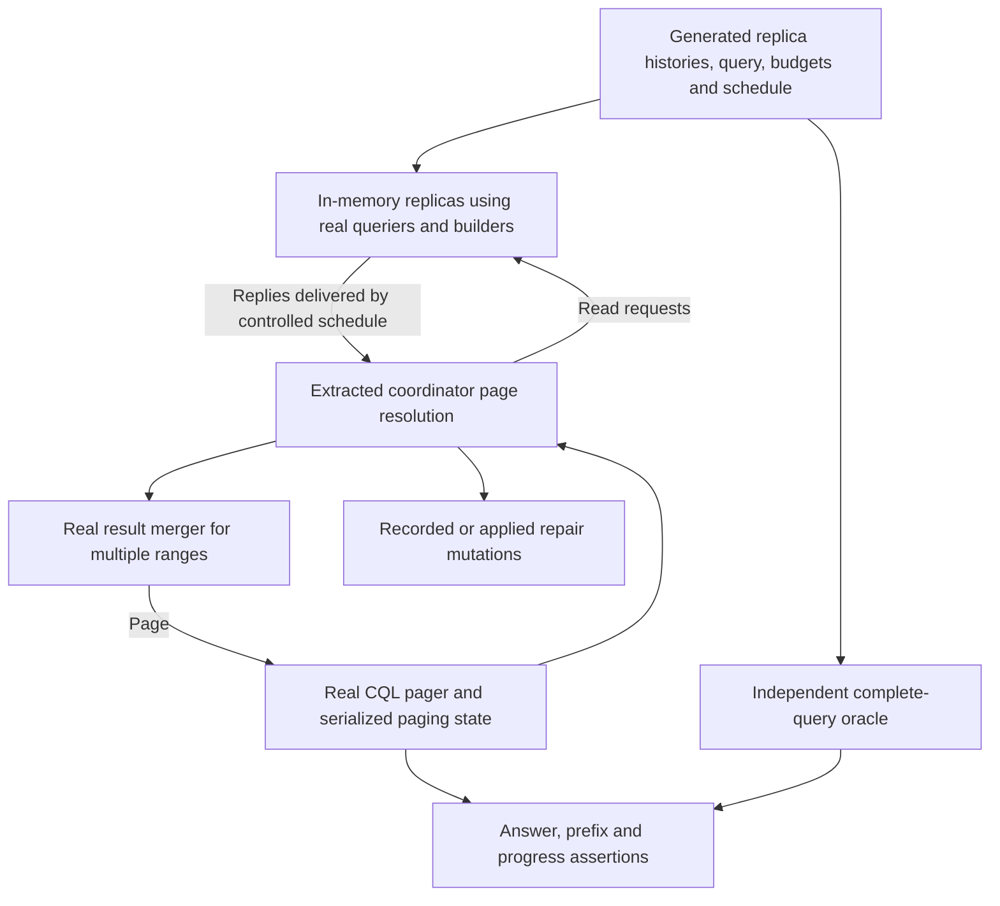

<!-- Copyright (C) 2026 ScyllaDB -->
<!-- SPDX-License-Identifier: LicenseRef-ScyllaDB-Source-Available-1.1 -->

# Paging and reconciliation: a property-test redesign

The historical input to this proposal is the 16-commit series `f4c5fca2231c..f72c59d9f1d0`. Commit `a9c234ce01` reverted its fixes and new test cases. Implementation starts from that reverted baseline: first build a testing layer that exposes the defects, then redesign the fixes using its evidence. The historical series is a catalogue of failure modes, not an implementation to restore or a set of APIs and tests available in the current tree. Use the fixed commit range above when consulting it; `HEAD^{/Local patches}..HEAD` now also includes the revert and documentation changes.

This is a high-level design, not an implemented or experimentally validated harness. The seams below are proposed boundaries around the current production code. Correctness properties describe the intended behavior and are expected to find failures on the baseline. Suggestions such as immutable decision snapshots, explicit progress metadata, and deferred partition decisions are possible later fixes, not prerequisites for building the tests.

**Recommendation: test the real read pipeline in one process, with several in-memory replicas and a controlled response schedule.** Extract the coordinator's page-resolution decisions from `storage_proxy.cc`; reuse the real replica querier, result builders, result merger, CQL pager, and paging-state serialization. Give the harness control over replica contents, page budgets, reader reuse, and response delivery. Compare the entire paged answer with a small independent model, while checking each page's safety and progress.

The important extraction is larger than `data_read_resolver::resolve()`, but much smaller than `storage_proxy`. It must include digest acceptance, mutation reconciliation, conversion to a data result, cursor finalization, and the decision to retry. Several historical fixes sat between these operations. Extracting only the merge would leave their contracts untested. Extract the existing behavior, including its defects, before changing any of these decisions.

**What the series says about the design.** The same few facts are inferred differently at different layers:

| Fact | Where the current code handles it | Failure exposed by the series |
| --- | --- | --- |
| How far a replica examined the query | Data cursor plus short-read flag; digest cursor without short status; mutation contents plus counts and short-read flag | An absent key can mean completion or no returned row. A cursor can exist after exhaustion. |
| How far the client may resume | Digest resolver, reconciliation trimming, conversion's last fragment, pager range construction | A retained tombstone or a late response can move the cursor independently of the returned rows. |
| How many rows the page represents | Compactor, mutation builder, resolver, data builder, filtering pager | Physical live rows, DISTINCT rows, pre-filter rows, and accepted rows are different counts. |
| Whether a partition has established a result row | Replica builder, reconciled-result conversion, pager continuation logic | A static-only row cannot normally be decided from an incomplete partition; DISTINCT has different rules. The baseline lacks the series' undecided-partition state and static-row suppression. |
| Which responses support a decision | Digest comparison at consistency, later asynchronous continuation | The result and cursor were derived from different sets of responses. |

These are protocol contracts, even when both sides are in one process. Tests of isolated row merging, or tests that compare only nonempty pages, cannot cover them.

There is already useful testing infrastructure. [mutation_query_test.cc](test/boost/mutation_query_test.cc) drives `replica::querier` with a `mutation_source` and the real data/digest and mutation builders. [querier_cache_test.cc](test/boost/querier_cache_test.cc) exercises real cache lookup and reader reuse. [multishard_query_test.cc](test/boost/multishard_query_test.cc) has a randomized scan test with small byte budgets and stateful/stateless reads. Its scan helper constructs continuations itself, and its oracle compares mutations; it does not cover divergent replicas, digest acceptance, or the CQL pager's DISTINCT/filtering/partition-continuation decisions. The reverted cluster regressions demonstrated those interactions, but obtaining divergence and particular page boundaries required node restarts, large tombstone populations, feature suppression, and timing injections. They can be read in history; `test/cluster/test_paging.py` from the series is no longer present.

Reuse the surviving infrastructure. Translate historical failure scenarios into generator families and replayable cases as the new layer develops; restoring the removed test suite is not a prerequisite. The missing facility is a cheap way to compose the production components around controlled divergent inputs.

**The unit under test should own the transition from replies to a pageable result.** Introduce an internal coordinator component, tentatively `service/read_page_resolution.{hh,cc}`. The name and exact types are secondary; the following ownership boundary is essential:

| Component | Inputs controlled at its boundary | Production work inside | Output |
| --- | --- | --- | --- |
| Foreground response collector | Replica identity, whether it counts toward CL, required count, data/digest reply events | Run existing CL/data-availability decisions and retain replies for subsequent processing | Foreground readiness and access to response state; expose the timing of each decision |
| Digest-page decision | Collector state, query schema/slice/limits, relevant existing feature capabilities | Run existing digest comparison and cursor selection at their current decision points | Accept a page, or request mutation reconciliation |
| Mutation-page resolution | Identified mutation replies, request ranges, current retry command, original output limits | Merge versions; calculate repair differences; run existing progress inference, trimming, sufficiency, conversion and retry decisions | Accept a page and repair plan, or return a retry command |
| Production executor | Actions from the components above | Select targets, dispatch local/RPC reads, schedule repairs, handle deadlines/errors, tracing and metrics | Deliver the accepted result after the required repair completion |

The first three rows are tested production code, not implementations supplied by the harness. They may use Seastar futures for gentle mutation processing. “Independent of storage_proxy” need not mean synchronous or allocation-free. Preserve the existing timing boundary between reaching CL and consuming the foreground result, including access to replies received in between; freezing those replies during extraction would silently fix one of the bugs before the harness can expose it.

For mutation resolution, move the algorithmic contents of `data_read_resolver`, plus the acceptance predicate, `to_data_query_result()` call and retry-limit calculation currently in `abstract_read_executor::reconcile()`. Preserve both sets of limits: an enlarged retry command determines what replicas read, while the original command determines what the page may return. Return a complete accepted page so the executor does not reconstruct it from resolver counts and getters. The historical `earliest_replica_stop()`/`trimmed_to_replica_stop()` getters and post-conversion cursor correction were reverted; they are not extraction targets or required replacements. The boundary must let tests observe whatever cursor the existing pipeline produces, and later accommodate a redesigned correction.

Keep repair calculation and its ordering relative to output processing unchanged during extraction. The accepted output includes repair differences separately from the client-visible page. The executor still performs repairs and waits as it does today. Test that a retry does not accidentally publish the tentative repair plan or a partial foreground result. When output trimming or suppression is redesigned, it must not become a database deletion: repair differences must reflect merged replica information, not absence introduced solely to shape a page. Keeping repair calculation inside the extracted algorithm makes that distinction testable.

For digest resolution, extract `digests_match()`, `min_position()`, the successful-response portion of `got_response()`, and the decision in the `has_cl()` continuation together. These are the baseline entry points; `earliest_stop()` was part of the reverted series. Topology determines which endpoints count toward CL outside this component. The component must own the decision points so tests can observe which replies each one used.

After the schedule tests expose inconsistent evidence, an immutable foreground snapshot is one possible fix. Such a snapshot would retain the identities of all replies observed at the decision point, including any already-received reply that did not count toward a local CL; it would not necessarily be a minimal quorum. The testing interface should support evaluating this design without requiring it in the initial extraction.

The harness can then deliver “data reaches CL; another reply arrives; foreground continuation runs” directly, with no sleep. The property is that later replies may affect background digest/repair work but must not change the page justified by the foreground decision. Expect the baseline to violate it. Include a thin adapter test using promises to check the production scheduling boundary; after a fix, it must establish that the executor actually uses the corrected decision rather than merely testing a new value type in isolation.

This boundary leaves placement, gossip, snitching, speculative-retry timers, admission control, fencing, and network error policy in `storage_proxy`. There is no need to build a mock storage proxy or a general simulated cluster to test the page semantics. Start with successful responses and explicit late deliveries; extend error scheduling only where it affects those semantics.

**Use the existing replica seam, including its stopping rules.** A test replica owns a small set of divergent mutations and serves reads through `mutation_source` → `replica::querier::consume_page()` → the production consumer:

- `query_result_builder` with `query::result::builder`, requesting data, digest, or both.
- `reconcilable_result_builder` for mutation reads.

Use the range-and-slice overload in [readers/from_mutations.hh](readers/from_mutations.hh). The local `make_source()` helper in `mutation_query_test.cc` currently asserts a full partition range; copying it unchanged would invalidate resumed-page tests. Keep the generated source data un-compacted so redundant tombstones still consume budgets. Fix query time and disable tombstone GC in the primary suite.

There is a small but essential piece of replica glue to share as well. `replica::table::query()` takes the cursor from `querier::current_position()` and passes it to `builder.build(last_pos)`; the builder alone does not supply the complete replica reply. Its range loop and querier lifetime also affect whether that position exists. Factor the page-driving/finalization part into an internal helper accepting the source, command, permit, budget accounter, and optional retained querier. Keep table gates, admission, and metrics outside. Both the in-memory replica and table path should call that helper. Preserve the real digest reply projection from `query_result_local_digest()`: on the baseline it omits short status even though the local result builder knows it. Keep that information available only to test diagnostics, not to the coordinator. Keep a small comparison corpus through the multishard producer, whose position-finalization path is separate. Otherwise the harness could accidentally normalize away the very exhausted-versus-stopped distinction that started this series.

Supply byte and tombstone budgets explicitly, using `result_memory_limiter::new_data_read()`, `new_digest_read()`, and `new_mutation_read()` with a generously provisioned private limiter. This isolates page limits from unrelated shard memory pressure. Different replicas and different request kinds may have different effective cuts; data and mutation formats consume different amounts of memory even with the same configured size.

The harness must not truncate a mutation vector at an arbitrary key and call it a replica page. Today mutation reads cannot stop on a static row or an individual range-tombstone change: their rowless tombstone-only page may finish the partition, exceed the size budget, and still be marked short. Data reads have other stopping rules. Those producer facts are precisely what the resolver's progress inference depends on.

For small generated inputs, sweep budgets around actual accounting boundaries, and assert that the intended kind of stop occurred. This is preferable to manufacturing thousands of tombstones. If this proves too expensive or leaves boundaries inaccessible, the narrow additional seam should be an injectable **budget-exhaustion signal** at the existing accounting checks. It must leave the production consumer responsible for whether stopping there is legal. Do not inject an already-computed cursor or bypass `consume_end_of_partition()`. Keep a corpus using real byte/tombstone limits to verify any such test facility agrees with production.

Run with fresh queriers, retained queriers, and eviction between selected pages. Retained runs must use the actual cache's insert/lookup validation where cache eligibility is under test; directly calling `consume_page()` on the same object would miss the DISTINCT cache regression. Drop page command/range objects between calls so stale references are not accidentally kept alive by the harness. Exercise resumption at partition end, where static content must sometimes be re-emitted.

The baseline `querier::consume_page()` does not accept the new page's slice, and the series' `start_new_page()` slice update and partition-end static re-emission were reverted. Drive the current API first, so retained-versus-fresh tests expose those gaps. Passing updated slice information through the compactor is a candidate fix to assess after the test layer exists.

**Use the real pager as the loop driver.** [query_pager.hh](service/pager/query_pager.hh) already exposes `query_function_override`, and `query_pagers::pager()` passes it through to the filtering pager. Initially instantiate the pager in one `cql_test_env`, with its query callback invoking the extracted coordinator and in-memory replicas. Construct the real selection and restrictions, and use both the result-generator path for trivial selections and the result-set-builder path for filtering. This immediately covers the two paths affected by the series.

The callback is not quite a storage-proxy-free seam: the pager retains `_proxy`, reads its maximum-result-size policy, and passes the proxy to the callback. That does not block an initial harness. If environment setup dominates runtime, replace these dependencies with a small query service containing a query callable and per-page policy accessors; let the production constructor bind those to the proxy. Preserve per-page policy evaluation, and allow future feature-dependent behavior to be tested across page boundaries if fixes introduce it. The series' deferred-static feature check is absent from the baseline pager. Do not first rewrite the pager into an independent model and then test that model instead of its existing visitors and range construction.

Test both a long-lived pager and a new pager per client page, restoring `paging_state::serialize()`/`deserialize()` through fresh query options. The latter covers coordinator changes without needing multiple servers. Preserve the original query options and let production construct the restricted slice. Record both the requested ranges and the resulting state; do not let the harness “repair” an incorrect continuation.

There is one more composition seam: multi-range result assembly. Drive the real `query::result_merger` with resolved pages for ordered singular ranges and scan subdivisions. The unpaged `IN` regression depends on a short flag making the merger discard later partitions. A test that stops at a single executor's result would not reproduce it. Reuse the assembly calls from `query_singular()`/`query_partition_key_range()` through a small internal helper if necessary, while keeping topology-driven range planning outside the high-volume suite. Retain integration coverage for that planning and multishard assembly.

The composed harness is therefore:

**Describe progress explicitly in the internal contract, without requiring a wire redesign first.** A page has at least three different boundaries: the replica's examined prefix, the last logical row it contributes, and the cursor from which the next request should resume. A static-only decision additionally depends on whether the remainder of the partition is known. Do not collapse these into one optional clustering key.

Use `full_position`/`position_in_partition` and their bound weights for observations and assertions, with one documented query-order convention. The coordinator already operates on a reversed schema for reversed queries; legacy mutation replies are normalized in `make_mutation_data_request()`. Test that adapter using the real reversal functions. The correctness requirement is that reconciliation not apply another reversal; the baseline's extra reversal is a defect to expose, not clean up during extraction. Partition order remains ring order; reversing clustering order does not reverse the partition ring.

Initially the harness must carry the **existing** reply representations unchanged into the extracted production logic. All baseline digest replies lack the short-read flag; this is not merely a mixed-version case. The series' conservative range-tombstone progress inference was also reverted. Record the producer's actual progress independently for assertions, but do not supply a corrected inference or private knowledge of partition completion to the coordinator. A non-short data or mutation reply is not universally exhausted: it may have reached a row or partition limit. A frozen mutation with no clustering key is not universally before or after the partition. These distinctions should produce failing tests before a redesigned progress representation or inference resolves them.

Separately, future explicit replica progress metadata could reduce the coupling between freezer representation and resolver inference and address missing information in digest replies. The producer could report its examined boundary and completion information directly. That is a protocol change, with compatibility work; it should not be a prerequisite for the overhaul. Tests should first expose where the current protocol or inference fails the semantic contract, then compare an explicit producer report against observed fragment consumption if such a field is introduced. The exact fields from the reverted series are not prescribed.

A lightweight diagnostic trace should record consumed positions, the reason a page stopped, reply identities, the boundary inferred by production, conversion boundary, counts, retries, and outgoing paging state. Observations may be test-only; they must not feed extra information into the production decision. An internal trace of actual partition-end consumption is stronger evidence than re-running the resolver's own progress inference in the assertion. Track unresolved partition decisions in the oracle even while production has no corresponding paging-state field; observe any new field only if a later fix introduces one.

**Use an independent oracle with a deliberately small semantic scope.** The primary workload has no concurrent writes, fixed read time, no GC, and a fixed set of participating replicas on every page. Begin with CL=ALL over two replicas; include one-replica reads and three-replica cases. Every accepted page is then part of a single well-defined result: execute the query over the complete reconciled contents of those replicas.

Represent generated history as operations on small integer keys, a row marker, static cells, and two regular cells, each with timestamps and tombstones. A simple reference evaluator resolves cells and row existence from the full history, applies partition/row/range deletions and fixed-time expiry, decides static-only existence over the full eligible partition, then applies query semantics and limits. Use distinct timestamps initially to avoid importing complex timestamp tie rules into the first model. Two regular cells and marker-less rows are necessary: independently live replica rows can become dead after reconciliation of complementary cell tombstones.

Separate row existence from selected columns. A live unselected static cell can establish a static-only row; a live unselected regular cell can establish a clustering row. Filtering a live clustering row out of the client answer must not retrospectively create a static-only row. Implement a small set of supported predicates explicitly, and compare ordered rows with multiplicity, not sets or just selected values. Record logical row identity alongside projected values so a duplicate remains detectable even when projections coincide. For DISTINCT, the logical identity is the partition.

The oracle must not call the resolver, its cursor/count helpers, or the page compactor to decide the expected answer. It can use schema key encoding/comparison and ordinary result decoding. Validate the reference semantics first against hand-derived examples and simple unpaged CQL reads. A second, broader differential suite can merge full mutations with production primitives and do an unlimited read; it is useful for schemas/types outside the small model, but sharing compaction and static-row counting makes it insufficient as the sole oracle.

Response scheduling needs a different scope. With arbitrary changing quorum participants, paged CQL does not promise a snapshot of the union of every replica. Do not assert that. For the strongest complete-answer property, fix the eligible participant set and ensure all are consulted each page. For speculative/local-CL schedules, record the evidence available when the foreground decision is made, and compare with a replay in which post-decision events are withheld until after delivery. Require identical foreground rows, short status, and cursor. The harness records this evidence without requiring production to freeze it. Check background behavior separately. Whole-query equality under schedule changes is valid for identical replicas, or otherwise only under explicitly fixed evidence assumptions.

Initially record repairs without applying them, to keep divergence stable and prevent a repair from hiding a paging error. In another mode, apply the emitted differences to replica histories before subsequent reads and check that the full merged logical database remains unchanged. Start that mode with fresh readers; exercise repair plus retained-reader interactions through the real table/cache integration path rather than inventing cache invalidation semantics for the simulator. Read repair convergence and cache performance are additional properties, not substitutes for checking the client answer.

**The properties should check both the answer and the intermediate protocol.**

| Property | What it detects |
| --- | --- |
| Concatenated client pages equal the independent complete answer, including order, multiplicity, filtering, LIMIT, PER PARTITION LIMIT, and DISTINCT | Missing rows, duplicates, spurious static-only rows, incorrect exhaustion and accounting |
| Every accumulated answer is an exact prefix of that answer in the fixed-participant suite | Rows returned before the lagging replica's deletes have been considered; prevents a later correct page from hiding an unsafe earlier page |
| A resumable empty page carries enough state to continue; resumption neither skips unresolved logical rows nor repeats emitted ones | Lost cursor, trailing-tombstone cursor drift, premature partition advancement |
| A finite scan terminates under bounded budgets and fair reply delivery | Repeated stops on re-emitted range-tombstone boundaries and retry loops |
| Serialization/recreation and cache retention/eviction preserve the logical answer | Missing paging-state fields, stale slice use, missing static re-emission |
| Pre-filter row existence, accepted-row limits, and the count belonging to the cursor partition evolve independently and correctly | Filtered live rows incorrectly leaving a partition undecided; counts transferred from P to Q or reset on empty pages |
| Data+digest and digest-only reads of the same source, command and effective budget agree on their shared metadata | Producer divergence between request kinds, lost short status |
| An accepted digest fast path gives a semantically safe page under the same evidence as mutation resolution | Digest blind spots and unsafe cursor adjustment; matching hashes alone are never the oracle |
| Trimming and output suppression do not become destructive repair mutations; retries retain original output limits | Repair/output confusion and enlarged retry results escaping to the client |
| Splitting an ordered query into ranges and merging their results preserves its answer | The unpaged IN truncation and cross-range short-page handling |

Do not assert strict increase of the raw cursor on every page. Boundary weights, a final partition-end continuation, and an exhausted replica's cursor make that too crude. Check advancement of the **effective next request** in query order, allowing completion of an unresolved partition decision. Detect repeated semantic states using requested ranges, remaining limits, the oracle's unresolved-partition status, and relevant reader position—not query UUIDs or counters that change on every iteration. Include any production pending-state field only if one is later introduced. Also impose finite page and retry limits scaled to the small input's possible positions and configured retry growth. A failure must print the repeated state or remaining unresolved rows, not time out after minutes.

Check output safety at the logical query level. A DISTINCT row can be established by a live static row before clustering is exhausted; ordinary static-only output requires a stronger absence proof. A numeric `min(cursor)` assertion cannot express both. Likewise, conversion can fill the page before the replicas' common stop: its earlier cursor must survive. Conversely, if output for the stop partition disappears completely, the page must still retain the information required to continue it.

**Generate relationships that force the hard cases.** Uniform independent random tables will mostly produce ordinary digest mismatches and pages that contain live rows. Start with tiny, correlated histories and exhaustive choices over a few boundaries, then add randomized composition and larger key/type diversity.

Give every test campaign mandatory families, with randomized keys, values, relative timestamps, direction, cuts, and neighboring partitions:

- Identical returned clustering rows/digests but different retained tombstones, stop positions, or completion status. Include absent, earlier, equal, and later data/digest cursors.
- A partition with static content and a dead prefix, followed either by live rows or by partition end. Independently vary static-column selection, static liveness, and ordinary versus DISTINCT queries.
- Marker-less rows whose cells are live separately but all dead after merging; divergent live clustering rows within one DISTINCT partition.
- A stopped replica with a newer deletion beyond its page, while another supplies the older live row; also a later range tombstone that survives output trimming.
- A page returning P's rows but stopping inside rowless Q, and several empty pages that remain inside P after its per-partition allowance is consumed.
- Mutation replies containing only static data, only range tombstones, or identical dead prefixes even though the preceding data/digest requests disagreed.
- A page whose conversion fills in P before the common replica stop in Q; a stop partition from which conversion receives no remaining fragments.
- A dead static row and a tombstone budget of one; range-tombstone opening/closing changes at the next page's start, in both clustering orders.
- A foreground decision followed by a late, conflicting short reply before its continuation is delivered.

Use very small row limits, partition limits, and tombstone budgets, especially one; sweep just below, at, and above a boundary. Include paged and unpaged commands, multi-partition IN, range scans, clustering restrictions, static columns not selected, trivial selection, filtering that rejects all rows of the cursor partition, and nontrivial PER PARTITION LIMIT. Test low-level per-partition command limits as well as CQL, whose filtering pager raises the command limit to the page size. Use native and legacy reversed-format adapters. Add compound clustering keys and prefix range bounds after the integer model works; these exercise position weights without expanding the initial semantic model to all CQL types.

A generated case only counts toward a family when its trace confirms the prerequisite: for example, matching digests with unequal stops, a cached continuation, or conversion filling before the replica stop. Track these categories as coverage obligations. Otherwise a change in memory accounting can quietly turn a purported reconciliation test into an ordinary full read.

**The historical commits define coverage obligations for the overhaul.** “Findable” should mean more than converting a historical reproducer to a fixed seed: a bounded generator family must produce several variants and expose the relevant defect within a measured budget. Start by measuring failures on the reverted baseline; there is no need to restore defective behavior there. After redesigned fixes land, retain these measurements and use targeted mutations to check that the properties still detect regressions.

This is a catalogue of semantic cases, not a sequence of patches to reapply. Some historical witnesses depended on behavior introduced earlier in the series, such as deferring static-only rows, and may not be reachable in that form on the baseline. Generate their underlying data/query relationships now, record the failure that actually occurs, and retain those families as later fixes make further states reachable. A preceding bug can mask another; do not require a separate baseline failure per commit or add historical behavior to the harness merely to obtain one. Desired outcomes below are assertions, not claims about current behavior.

| Commit | Mandatory generated witness and detection |
| --- | --- |
| `cbd6afe6cb` | Equal digests with empty short data and an exhausted digest replica; earlier replica stop; unpaged IN. Check cursor preservation, complete answer and range assembly. |
| `3a76dd076f` | Digest replica stops short at or after an exhausted data replica's cursor. Its hidden suffix must eventually appear. Baseline replies omit short status; if a later fix adds metadata, retain a compatibility case for its absence. |
| `f7e42a7d68` | Static-only and range-tombstone-only mutation replies, forward/native reverse/legacy reverse. Check safe continuation, no lost rows, and no avoidable larger retry in the complete-static case. |
| `776bbaf665` | DISTINCT P merges multiple live rows; Q loses liveness on merge; a replica stops before R's deletion. Check both unsafe output and premature exhaustion. |
| `ac6608e490` | A trailing tombstone beyond a replica stop, with and without clustering-row trimming. Check the next request does not skip the intervening live row. |
| `64e4ca281b` | Cached continuation after a live row into a dead suffix with static content and later partitions. Compare with fresh readers and the complete oracle. |
| `7cf6143064` | Dead static row consumes budget one before a live clustering row; also several partitions containing only dead statics. Check no skipped partition suffix and bounded progress. |
| `5cf935471f` | Re-emitted range-tombstone changes at page start with budget one, including reversed closing boundaries. Detect repeated effective requests. |
| `3504bb07fd` | Output in P/cursor in Q, and empty pages within an already-counted P. Check per-partition counts and full answer. |
| `ff088ca0b3` | A dead prefix leaves static-only existence unresolved until later live clustering rows or partition end; selected/unselected static columns, filtering, cached partition-end resumption. Check existence, limits and serialized continuation without assuming a production pending-state field. |
| `aed19a5f1c` | Trimmed-away live row, no live row reached, trimmed row later deleted, identical mutation prefixes, and conversion filling before the stop. Check deferred output and exact continuation in all order formats. |
| `87a340bd41` | DISTINCT with no live static content and a dead prefix. Check continuation, range-tombstone progress, both pager paths, and actual cache reuse eligibility. |
| `1d62bea32f` | Deliver a conflicting late short reply after CL but before foreground consumption. Foreground result must match the replay without the late delivery. |
| `70c0b43291` | Check that accepted output never passes an unresolved replica boundary, independently of the count estimate used to predict conversion's last row. This historical change was defense in depth, not an independent reproducer. Exercise the baseline's counting/boundary defects now; after redesign, a focused perturbation of internal count estimates can test this robustness property if still applicable. |
| `c05317d472` | Data replica has only static content; another has the same static content and a dead prefix before live rows; static column unselected. Check output and LIMIT against the complete oracle. If a later design defers rows, additionally exercise equal digests when one replica emits static-only and another defers it; that exact historical state depends on deferral. |
| `f72c59d9f1` | Only one replica has live static content; another has its retained tombstone, no clustering rows, no selected static columns. Generate both data-replica roles. Expose the extra-row and missing-row cases that even the historical series left unresolved. |

Multiple families are expected to fail on the reverted baseline. Record minimized known failures individually, with their triggering conditions and semantic assertions. Keep discovery runs able to report additional failures rather than stopping permanently at the first known one. If CI needs a passing harness milestone before fixes, separate checks of the harness/oracle and unaffected cases from explicitly tracked failing production cases; do not weaken the complete-answer oracle or mark an entire property as exempt. The last row deserves attention because the historical series never fixed it either. It indicates that digest equivalence needs to account for static-only row existence; decide the corrective mechanism and any wire/feature change after the testing layer demonstrates the gap.

Compatibility is a separate test profile. Initially exercise capabilities that actually remain in the baseline, including `empty_replica_pages`, `empty_replica_mutation_pages`, and native/legacy reverse formats. The optional digest short flag, deferred-static slice option/feature, and undecided-partition paging-state field from the series were reverted; do not invent enabled variants for them in the initial harness. When redesigned fixes introduce protocol or state changes, add their supported mixed-version combinations, absent-field/default behavior, and feature activation between pages. If a design carries unresolved partition state across coordinators, test continuing it before the receiving coordinator locally observes feature activation. Keep semantic failures distinct from compatibility expectations, and verify wire behavior with adapter/integration cases; a boolean switch in the harness does not prove serialization compatibility.

**Make failures reproducible and small.** Use the existing Boost `--random-seed` plumbing, with explicit sub-seeds for histories, query choices, budgets, and event schedules. Fix time, eliminate sleeps, and deliver events through a deterministic queue. Log the full case as well as its seed: generator changes, byte accounting, and build modes can otherwise make an old seed cease to reproduce.

Shrink operations and replicas, then partitions/rows/columns, then query options and budgets, preserving the triggering relationship and failure. Shrink key order and timestamp order, not just their raw integers. Treat tombstone runs and their budget as a coupled object; deleting tombstones without shrinking the budget can erase the early stop. Similarly preserve the event order around the CL decision and foreground continuation. Save the minimized history, command, capability profile, budget schedule, cache choices, and delivered events as a replayable corpus entry. A page trace should show both expected and actual rows, including identities before projection.

Run a fixed seed/corpus set and bounded boundary enumeration in normal CI, with the explicit baseline-failure tracking described above; run more seeds and shrinking in a larger scheduled campaign. Random exploration can be deterministic and repeatable, consistent with the repository's test philosophy. Measure discovered failures, generator-category coverage, and time-to-find on the baseline first and on intentionally defective variants after fixes. Use those measurements to choose iteration counts rather than promising an arbitrary number of random iterations will catch everything. Keep the repository's repeated-run stability check for new tests, and reduce corpus breadth rather than change semantics in debug builds.

**Implement the overhaul in reviewable stages.**

1. Extract the baseline coordinator decisions and shared replica page driver with behavior preserved. Use surviving tests and new adapter/characterization cases to compare the extracted code with its original behavior, including conversion/cursor and retry paths. These checks validate the extraction, not correctness of the baseline. Do not rely on the reverted cluster regression suite or reintroduce its fixes.
2. Add the independent small-history evaluator and composed real-pager loop. Cover two replicas, real budgets, forward order, fresh readers, ordinary/static/DISTINCT queries, and range assembly. Demonstrate and record failures on the baseline before broadening generation.
3. Add retained cache entries, serialized pager recreation, filtering/per-partition limits, reverse adapters, and deterministic foreground/late-reply delivery. Exercise each historical family reachable on the baseline, recording dependencies or masking failures for the others. Include the digest blind spot that the series itself left unresolved.
4. Add replay/shrinking, repair application, baseline compatibility profiles, and a compact adapter/integration corpus through real local/multishard query paths. Establish measured discovery coverage and reproducibility. This is the testing-layer milestone; it can be complete while the known production defects still fail their semantic assertions.
5. Only after that milestone, redesign fixes against the new properties. Evaluate changes to progress metadata, digest semantics, counting, response evidence and partition continuation as needed, without treating the historical patches as the required solution. Promote each resolved failure to an ordinary passing regression, expand coverage for newly reachable states, and add compatibility tests for any new protocol. Broader schemas and sustained campaigns can then build on the demonstrated core coverage.

Most new code in the testing-layer phase belongs in test helpers: scenario representation, reference evaluation, deterministic delivery, diagnostics, and shrinking. Production changes in that phase should be behavior-preserving coordinator extraction, shared replica page driving/finalization, and, if needed after measuring setup costs, the small pager query-service boundary. These are per-request seams; avoid adding virtual calls to fragment processing or extra mutation copies just for testability. The testing-layer completion criterion is a production-used component that the harness can drive end to end, with demonstrated discovery, replayable failures, and explicit coverage gaps. Correcting those failures is the subsequent redesign phase.
